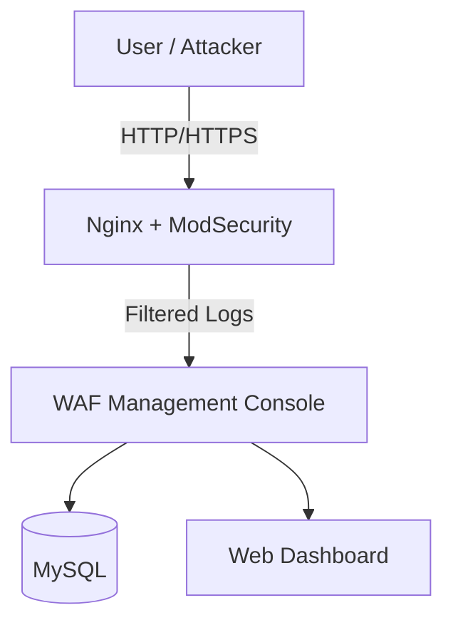

# 🔐 WAF Project (Web Application Firewall)

A practical project to design and implement a **Web Application Firewall (WAF)** using **Nginx, ModSecurity, and OWASP CRS**, and extend it with a **multi-tenant SaaS management console**.  
### 👉🏻 목표: 보안 강화 + 실무형 SaaS 아키텍처 학습

---

## 🚀 Overview
이 프로젝트의 목적은 단순히 **WAF 설치**를 넘어서, **실제 운영 가능한 SaaS 기반 보안 서비스**를 설계·구현하는 데 있다.  

- 웹 애플리케이션 보호: SQL Injection, XSS, Path Traversal 등  
- 기본 **OWASP CRS 룰셋** 위에, 시나리오 기반 **커스텀 룰 작성**  
- 관리자 콘솔에서 멀티 테넌트 환경을 지원  
  - 테넌트별 룰 관리 및 로그 확인  
  - Google OAuth2 기반 로그인  

---

## ✨ Features
### 👉🏻 WAF Core
- Nginx + ModSecurity v3 통합
- OWASP CRS (Core Rule Set) 적용
- Custom Rules (SQLi, Path Traversal, XSS 등 시나리오 기반 최적화)

### 👉🏻 Console Backend
- Google OAuth2 로그인 (SaaS 모델)
- Role-based Access Control (User / Admin)
- 멀티테넌시 지원 (Tenant Context)
- Rule 관리 API + 로그 관리 API 제공

### 👉🏻 Future Work
- 공격 트래픽 자동 생성기 (테스트용)
- ELK / Grafana 기반 로그 시각화
- CI/CD 파이프라인 연동

---

## 🏗 Architecture


## 📜 Custom Rule Examples
### SQL Injection 예시
```
SecRule REQUEST_URI "(union.*select.*from)" \
    "id:1001,phase:2,deny,status:403,msg:'SQL Injection detected'"
```
### Path Traversal 예시
```
SecRule REQUEST_URI "\.\./" \
    "id:1002,phase:2,deny,status:403,msg:'Path Traversal attempt'"
```
## 🔧 Installation & Usage
### 1. Prerequisites
- Docker & Docker Compose
- Java 17 (Spring Boot backend)
- Gradle

### 2. Clone Repository
```
git clone https://github.com/ParkJuhan94/WAF.git
cd WAF
```
### 3. Run WAF with Docker
```
docker-compose up -d
```
### 4. Backend Console (Spring Boot)
```
cd backend
./gradlew bootRun
```

## 🛠 Tech Stack
- Core: Nginx, ModSecurity, OWASP CRS
- Backend: Java 17, Spring Boot 3, JPA, MySQL
- Auth: Google OAuth2
- Infra: Docker, Docker Compose
- Monitoring: ELK Stack, Grafana

## 📅 Development Roadmap
### 1. 개발 환경 구성
- Docker, Git, ModSecurity 기본 세팅
- Repo 생성 및 환경 구축
### 2. OWASP CRS 적용
- Nginx + ModSecurity + OWASP CRS 연동
- 룰 동작 확인 및 로그 수집
### 3. 커스텀 룰 작성 및 최적화
- 시나리오 기반 룰 작성
- 탐지 정확도 및 성능 최적화 (룰 순서/조건)
### 4. SaaS 구조 설계 및 관리자 콘솔
- 멀티 테넌트 대응 설계
- Google OAuth2 로그인
- 기본 UI 설계 (룰 관리, 로그 확인)
### 5. 테스트 자동화 및 로그 시각화
- 공격 트래픽 자동 생성기 작성
- ELK / Grafana 기반 로그 시각화

### 6. 통합 테스트 및 배포
- CI/CD 파이프라인 구성
- 최종 통합 테스트 및 안정화
