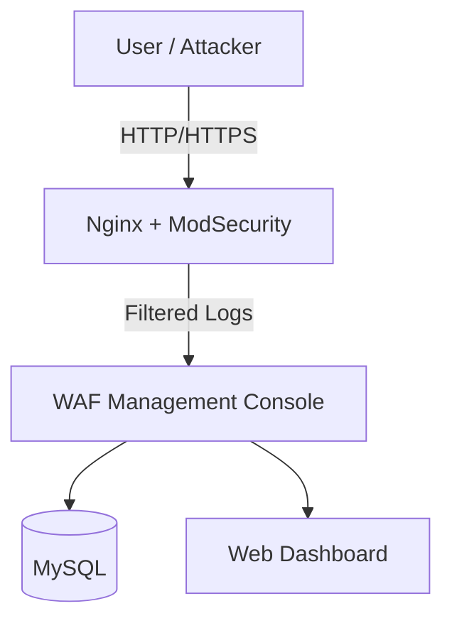

# 🔐 WAF Project (Web Application Firewall)

A practical project to design and implement a **Web Application Firewall (WAF)** using **Nginx, ModSecurity, and OWASP CRS**, and extend it with a **multi-tenant SaaS management console**.  

---

## 🚀 Overview
The WAF Project aims to:
- Protect web applications from common attacks (SQL injection, XSS, Path Traversal, etc.).
- Extend the default OWASP CRS with **custom detection rules** tailored to specific scenarios.
- Provide a **SaaS-based management console** for administrators to:
  - Manage rules (create, update, delete).
  - View and analyze logs.
  - Support multi-tenancy (per-tenant policy and auditing).

---

## ✨ Features
- **WAF Core**
  - Nginx + ModSecurity v3 integration
  - OWASP Core Rule Set (CRS) baseline
  - Custom rules optimized by scenario
- **Console Backend**
  - Google OAuth2 login (SaaS model)
  - Role-based access control (User / Admin)
  - Multi-tenant support (Tenant context isolation)
  - Rule & log management APIs
- **Future Work**
  - Automated attack traffic generation (for testing)
  - Log visualization with ELK/Grafana
  - CI/CD pipeline integration

---

## 🏗 Architecture

---
## 🔧 Installation & Usage
### 1. Prerequisites
- Docker & Docker Compose
- Java 17 (for backend console)
- Gradle

### 2. Clone Repository
```bash
git clone https://github.com/ParkJuhan94/WAF.git
cd WAF
```
### 3. Run WAF with Docker
```bash
docker-compose up -d
```
### 4. Backend Console (Spring Boot)
```bash
cd backend
./gradlew bootRun
```
---

## 🛠 Tech Stack
- Core: Nginx, ModSecurity, OWASP CRS
- Backend: Java 17, Spring Boot 3, JPA, MySQL
- Auth: Google OAuth2
- Infra: Docker, Docker Compose
- Monitoring: ELK Stack, Grafana
--- 
