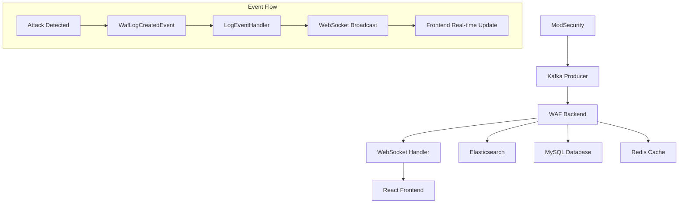

---

## **🚀 10. 환불 조건 대응 전략**

### **📋 환불 조건 체크리스트**
```yaml
자동 검증 항목:
  ✅ DVWA 정상 요청 통과:
    - GET /login.php → 200 OK
    - GET /index.php → 200 OK
    - POST /login.php (정상 로그인) → 302 Found
    
  ✅ 5가지 공격 유형 차단:
    - SQL Injection: "' OR '1'='1" → 403 Forbidden
    - XSS: "<script>alert(1)</script>" → 403 Forbidden  
    - 악성 파일 업로드: "test.php" → 403 Forbidden
    - Command Injection: "; ls && cat /etc/passwd" → 403 Forbidden
    - Path Traversal: "../../../etc/passwd" → 403 Forbidden
    
  ✅ 증거 수집:
    - 차단 응답 스크린샷 자동 캡처
    - WAF 로그 자동 수집 및 저장
    - ModSecurity 로그 파싱 및 연동
    - PDF 증거 리포트 자동 생성
```

### **🎯 핵심 API 매핑**
```typescript
프론트엔드 요구사항 → 백엔드 API 매핑:

// AttackSimulator.tsx → SimulationController
POST /api/v1/simulation/batch-test
- 5가지 공격 시나리오 일괄 실행
- 자동 스크린샷 캡처
- 차단 증거 수집

// DVWAIntegration.tsx → SimulationController  
POST /api/v1/simulation/dvwa-test
- DVWA 정상 요청 테스트
- 통과율 검증

// TestReport.tsx → ReportController
POST /api/v1/reports/refund-evidence
- 환불 심사용 PDF 리포트 생성
- 스크린샷 + 로그 + 통계 포함

// TrafficChart.tsx → WebSocket + DashboardController
WebSocket: /ws/dashboard
- 실시간 트래픽 모니터링
- 공격 차단 실시간 알림

// RecentAttacks.tsx → LogController
GET /api/v1/logs/recent
- 최근 공격 로그 스트림
- 심각도별 필터링

// WhitelistPanel.tsx → WhitelistController  
CRUD /api/v1/whitelist/*
- IP/도메인 화이트리스트 관리
- 대량 업로드 지원
```

### **🔄 실시간 연동 아키텍처**


---

이제 **프론트엔드 명세서와 100% 일치하는 완전한 백엔드 명세서**가 완성됐어! 🎯

**주요 추가/보완 사항:**
- ✅ **실시간 WebSocket API** (traffic_update, attack_blocked, log_entry)
- ✅ **공격 시뮬레이션 API** (5가지 공격 유형 + DVWA 테스트)
- ✅ **화이트리스트 관리 도메인** (IP, 도메인, 대량 업로드)
- ✅ **PDF 리포트 생성** (환불 조건 증거 수집)
- ✅ **상세한 대시보드 통계** (프론트 TrafficChart, StatsCards용)
- ✅ **스크린샷 # 🛡️ **WAF SaaS Backend 아키텍처 명세서**

## **📋 프로젝트 개요**

**목표**: ModSecurity 기반 WAF 관리 SaaS 플랫폼 Backend 구현  
**아키텍처**: Clean Architecture + CQRS + Event-Driven Architecture  
**기술스택**: Spring Boot 3.x, Java 21, MySQL, Redis, Elasticsearch, Kafka

---

## **🏗️ 1. 모듈 구조 (Clean Architecture 기반)**

```
be-waf/
├── api/                    # 🎯 Presentation Layer
│   ├── auth/              # OAuth2 인증 컨트롤러
│   │   ├── AuthController.java
│   │   └── dto/           # Request/Response DTOs
│   ├── rules/             # WAF 룰 관리 API
│   │   ├── RuleController.java
│   │   ├── RuleQueryController.java  # CQRS - Query
│   │   └── dto/
│   ├── logs/              # 로그 조회/분석 API
│   │   ├── LogController.java
│   │   ├── DashboardController.java
│   │   └── dto/
│   ├── whitelist/         # 🆕 화이트리스트 관리 API
│   │   ├── WhitelistController.java
│   │   └── dto/
│   ├── simulation/        # 🆕 공격 시뮬레이션 API
│   │   ├── SimulationController.java
│   │   ├── ReportController.java
│   │   └── dto/
│   ├── websocket/         # 🆕 실시간 WebSocket API
│   │   ├── DashboardWebSocketController.java
│   │   └── dto/
│   └── common/            # 공통 API 컴포넌트
│       ├── GlobalExceptionHandler.java
│       ├── ResponseWrapper.java
│       └── validation/
│
├── core/                   # 🧠 Business Logic Layer
│   ├── domain/            # 도메인 엔티티 & 비즈니스 로직
│   │   ├── user/
│   │   │   ├── User.java
│   │   │   ├── UserId.java (Value Object)
│   │   │   └── UserRole.java (Enum)
│   │   ├── rule/
│   │   │   ├── WafRule.java
│   │   │   ├── RuleId.java
│   │   │   ├── RuleType.java
│   │   │   └── RuleStatus.java
│   │   ├── log/
│   │   │   ├── WafLog.java
│   │   │   ├── LogId.java
│   │   │   ├── AttackType.java
│   │   │   └── LogLevel.java
│   │   ├── instance/
│   │   │   ├── WafInstance.java
│   │   │   └── InstanceId.java
│   │   ├── whitelist/         # 🆕 화이트리스트 도메인
│   │   │   ├── WhitelistEntry.java
│   │   │   ├── WhitelistId.java
│   │   │   ├── WhitelistType.java (IP, DOMAIN, USER_AGENT)
│   │   │   └── WhitelistStatus.java
│   │   └── simulation/        # 🆕 공격 시뮬레이션 도메인
│   │       ├── AttackSimulation.java
│   │       ├── SimulationId.java
│   │       ├── SimulationStatus.java
│   │       ├── AttackScenario.java
│   │       └── TestResult.java
│   │
│   ├── usecase/           # 유스케이스별 비즈니스 로직
│   │   ├── auth/
│   │   │   ├── GoogleOAuthUseCase.java
│   │   │   └── JwtTokenUseCase.java
│   │   ├── rule/
│   │   │   ├── CreateRuleUseCase.java
│   │   │   ├── UpdateRuleUseCase.java
│   │   │   └── DeleteRuleUseCase.java
│   │   ├── log/
│   │   │   ├── LogAnalysisUseCase.java
│   │   │   └── DashboardDataUseCase.java
│   │   ├── whitelist/         # 🆕 화이트리스트 유스케이스
│   │   │   ├── AddWhitelistEntryUseCase.java
│   │   │   ├── RemoveWhitelistEntryUseCase.java
│   │   │   └── BulkWhitelistImportUseCase.java
│   │   └── simulation/        # 🆕 공격 시뮬레이션 유스케이스
│   │       ├── ExecuteAttackSimulationUseCase.java
│   │       ├── GenerateComplianceReportUseCase.java
│   │       └── DVWATestUseCase.java
│   │
│   ├── service/           # 도메인 서비스
│   │   ├── RuleValidationService.java
│   │   ├── LogProcessingService.java
│   │   ├── SecurityAnalysisService.java
│   │   ├── RealTimeNotificationService.java  # 🆕 실시간 알림
│   │   └── ReportGenerationService.java      # 🆕 PDF 리포트 생성
│   │
│   └── repository/        # Repository 인터페이스 (Port)
│       ├── UserRepository.java
│       ├── WafRuleRepository.java
│       ├── WafLogRepository.java
│       ├── WafInstanceRepository.java
│       ├── WhitelistRepository.java          # 🆕 화이트리스트
│       └── SimulationRepository.java         # 🆕 시뮬레이션
│
├── infrastructure/         # 🔧 Infrastructure Layer
│   ├── persistence/       # JPA 구현체 (Adapter)
│   │   ├── entity/        # JPA Entity
│   │   │   ├── UserEntity.java
│   │   │   ├── WafRuleEntity.java
│   │   │   ├── WafLogEntity.java
│   │   │   ├── WhitelistEntity.java      # 🆕 화이트리스트 엔티티
│   │   │   └── SimulationEntity.java     # 🆕 시뮬레이션 엔티티
│   │   ├── mapper/        # Entity ↔ Domain 매핑
│   │   │   ├── UserMapper.java
│   │   │   ├── RuleMapper.java
│   │   │   ├── LogMapper.java
│   │   │   ├── WhitelistMapper.java      # 🆕
│   │   │   └── SimulationMapper.java     # 🆕
│   │   └── repository/    # JPA Repository 구현
│   │       ├── JpaUserRepository.java
│   │       ├── JpaWafRuleRepository.java
│   │       ├── JpaWafLogRepository.java
│   │       ├── JpaWhitelistRepository.java   # 🆕
│   │       └── JpaSimulationRepository.java  # 🆕
│   │
│   ├── external/          # 외부 API 연동
│   │   ├── oauth/
│   │   │   ├── GoogleOAuthClient.java
│   │   │   └── GoogleUserInfoClient.java
│   │   ├── modsecurity/
│   │   │   ├── ModSecurityApiClient.java
│   │   │   ├── RuleDeploymentClient.java
│   │   │   └── AttackSimulationClient.java   # 🆕 공격 시뮬레이션
│   │   ├── elasticsearch/
│   │   │   ├── ElasticsearchLogClient.java
│   │   │   └── LogSearchClient.java
│   │   ├── report/                          # 🆕 리포트 생성
│   │   │   ├── PDFReportGenerator.java
│   │   │   └── ScreenshotCaptureService.java
│   │   └── websocket/                       # 🆕 WebSocket 연동
│   │       ├── WebSocketHandler.java
│   │       ├── WebSocketSessionManager.java
│   │       └── RealTimeDataBroadcaster.java
│   │
│   └── config/            # 설정 클래스
│       ├── SecurityConfig.java
│       ├── DatabaseConfig.java
│       ├── RedisConfig.java
│       ├── KafkaConfig.java
│       ├── ElasticsearchConfig.java
│       └── WebSocketConfig.java             # 🆕 WebSocket 설정 외부 API 연동
│   │   ├── oauth/
│   │   │   ├── GoogleOAuthClient.java
│   │   │   └── GoogleUserInfoClient.java
│   │   ├── modsecurity/
│   │   │   ├── ModSecurityApiClient.java
│   │   │   └── RuleDeploymentClient.java
│   │   └── elasticsearch/
│   │       ├── ElasticsearchLogClient.java
│   │       └── LogSearchClient.java
│   │
│   └── config/            # 설정 클래스
│       ├── SecurityConfig.java
│       ├── DatabaseConfig.java
│       ├── RedisConfig.java
│       ├── KafkaConfig.java
│       └── ElasticsearchConfig.java
│
├── event/                  # 📡 Event-Driven Architecture
│   ├── domain/            # 도메인 이벤트
│   │   ├── RuleCreatedEvent.java
│   │   ├── RuleUpdatedEvent.java
│   │   ├── WafLogCreatedEvent.java
│   │   ├── AttackBlockedEvent.java           # 🆕 공격 차단 이벤트
│   │   ├── WhitelistUpdatedEvent.java        # 🆕 화이트리스트 변경
│   │   └── SystemStatusChangedEvent.java     # 🆕 시스템 상태 변경
│   ├── handler/           # 이벤트 핸들러
│   │   ├── RuleEventHandler.java
│   │   ├── LogEventHandler.java
│   │   ├── RealTimeNotificationHandler.java  # 🆕 실시간 알림
│   │   └── ReportGenerationHandler.java      # 🆕 리포트 생성
│   └── publisher/         # 이벤트 발행자
│       ├── DomainEventPublisher.java
│       ├── KafkaEventPublisher.java
│       └── WebSocketEventPublisher.java     # 🆕 WebSocket 이벤트
│
├── common/                 # 🔄 Shared Kernel
│   ├── exception/         # 예외 처리
│   │   ├── BusinessException.java
│   │   ├── ResourceNotFoundException.java
│   │   └── ValidationException.java
│   ├── utils/             # 유틸리티
│   │   ├── DateTimeUtils.java
│   │   ├── SecurityUtils.java
│   │   └── JsonUtils.java
│   ├── constants/         # 상수 정의
│   │   ├── ApiConstants.java
│   │   └── ErrorConstants.java
│   └── annotation/        # 커스텀 애노테이션
│       ├── UseCase.java
│       └── DomainService.java
│
└── test/                   # 🧪 테스트 코드
    ├── unit/              # 단위 테스트
    ├── integration/       # 통합 테스트
    └── e2e/              # E2E 테스트
```

---

## **🎯 2. 핵심 도메인 모델**

### **👤 User 도메인**
```java
@Entity
public class User {
    private UserId id;
    private String email;
    private String name;
    private String profileImage;
    private UserRole role;
    private LocalDateTime createdAt;
    private LocalDateTime lastLoginAt;
    
    // 비즈니스 메서드
    public void updateLastLogin() { /* ... */ }
    public boolean canManageRule(WafRule rule) { /* ... */ }
}

public enum UserRole {
    FREE_USER, PREMIUM_USER, ADMIN
}
```

### **🛡️ WafRule 도메인**
```java
@Entity
public class WafRule {
    private RuleId id;
    private String ruleName;
    private String ruleContent;
    private String description;
    private RuleType type;
    private RuleStatus status;
    private UserId ownerId;
    private Integer priority;
    private LocalDateTime createdAt;
    private LocalDateTime updatedAt;
    
    // 비즈니스 메서드
    public void activate() { /* ... */ }
    public void deactivate() { /* ... */ }
    public boolean isValidSyntax() { /* ... */ }
}

public enum RuleType {
    OWASP_CRS, CUSTOM, WHITELIST
}

public enum RuleStatus {
    DRAFT, ACTIVE, INACTIVE, DEPRECATED
}
```

### **📊 WafLog 도메인**
```java
@Document(indexName = "waf-logs")
public class WafLog {
    private LogId id;
    private Timestamp timestamp;
    private String clientIp;
    private String userAgent;
    private String requestMethod;
    private String requestPath;
    private String requestBody;
    private Map<String, String> requestHeaders;    # 🆕 상세 헤더 정보
    private AttackType attackType;
    private RuleId triggeredRuleId;
    private String ruleName;
    private LogLevel severity;
    private String responseStatus;
    private Long responseTime;
    private GeoLocation geoLocation;               # 🆕 지리적 위치
    private Boolean blocked;                       # 🆕 차단 여부
    private Integer riskScore;                     # 🆕 위험도 점수
    
    // 분석 메서드
    public boolean isCriticalAttack() { /* ... */ }
    public String getAttackSignature() { /* ... */ }
    public boolean isFromWhitelistedIp() { /* ... */ }  # 🆕
}

@Embeddable
public class GeoLocation {
    private String country;
    private String city;
    private Double latitude;
    private Double longitude;
    private String isp;
}

public enum AttackType {
    XSS, SQL_INJECTION, CSRF, PATH_TRAVERSAL, 
    COMMAND_INJECTION, FILE_UPLOAD, BRUTE_FORCE, 
    BOT_ATTACK, RATE_LIMIT_EXCEEDED, UNKNOWN      # 🆕 추가 공격 유형
}
```

### **🆕 WhitelistEntry 도메인**
```java
@Entity
public class WhitelistEntry {
    private WhitelistId id;
    private String value;              # IP 주소 또는 도메인
    private String cidrRange;          # CIDR 표기법 (IP용)
    private WhitelistType type;
    private String description;
    private UserId addedBy;
    private LocalDateTime createdAt;
    private LocalDateTime expiresAt;   # 만료 시간 (선택사항)
    private LocalDateTime lastUsed;    # 마지막 사용 시간
    private WhitelistStatus status;
    
    // 비즈니스 메서드
    public boolean isExpired() { /* ... */ }
    public boolean matches(String clientIp) { /* ... */ }
    public void updateLastUsed() { /* ... */ }
}

public enum WhitelistType {
    IP_ADDRESS, IP_RANGE, DOMAIN, USER_AGENT, COUNTRY
}

public enum WhitelistStatus {
    ACTIVE, INACTIVE, EXPIRED, PENDING_DEPLOYMENT
}
```

### **🆕 AttackSimulation 도메인**
```java
@Entity
public class AttackSimulation {
    private SimulationId id;
    private String testName;
    private String targetUrl;
    private AttackType attackType;
    private String payload;
    private SimulationStatus status;
    private UserId executedBy;
    private LocalDateTime createdAt;
    private LocalDateTime completedAt;
    private TestResult result;
    
    // 비즈니스 메서드
    public void start() { /* ... */ }
    public void complete(TestResult result) { /* ... */ }
    public boolean isCompliant() { /* ... */ }
}

@Embeddable
public class TestResult {
    private Boolean blocked;
    private Integer responseStatus;
    private Long responseTime;
    private String ruleTriggered;
    private String screenshotPath;     # 차단 증거 스크린샷
    private String rawResponse;
    private String wafLogId;           # 연관된 WAF 로그
}

public enum SimulationStatus {
    PENDING, RUNNING, COMPLETED, FAILED, CANCELLED
}
```

---

## **🌐 3. API 명세서**

### **🔐 인증 API**
```yaml
POST /api/v1/auth/google
Description: OAuth2 구글 소셜 로그인
Request:
  code: string
  state: string
Response:
  accessToken: string
  refreshToken: string
  expiresIn: number
  userProfile:
    id: string
    email: string
    name: string
    profileImage: string
    role: "FREE_USER" | "PREMIUM_USER" | "ADMIN"

POST /api/v1/auth/refresh
Description: JWT 토큰 갱신
Request:
  refreshToken: string
Response:
  accessToken: string
  expiresIn: number
```

### **⚙️ WAF 룰 관리 API**
```yaml
GET /api/v1/rules
Description: 룰 목록 조회 (페이징 + 필터링)
Parameters:
  page: number (default: 0)
  size: number (default: 20)
  type: "OWASP_CRS" | "CUSTOM" | "WHITELIST"
  status: "ACTIVE" | "INACTIVE" | "DRAFT"
  search: string
Response:
  content: RuleDto[]
  page:
    totalElements: number
    totalPages: number
    currentPage: number
    size: number

POST /api/v1/rules
Description: 커스텀 룰 생성
Request:
  ruleName: string
  ruleContent: string
  description: string
  type: "CUSTOM" | "WHITELIST"
  priority: number
Response:
  ruleId: string
  status: "CREATED"
  validationResult:
    isValid: boolean
    errors: string[]

PUT /api/v1/rules/{ruleId}
Description: 룰 수정
Request:
  ruleName: string
  ruleContent: string
  description: string
  priority: number

PUT /api/v1/rules/{ruleId}/status
Description: 룰 활성화/비활성화
Request:
  status: "ACTIVE" | "INACTIVE"
Response:
  ruleId: string
  previousStatus: string
  newStatus: string
  deploymentStatus: "PENDING" | "SUCCESS" | "FAILED"

DELETE /api/v1/rules/{ruleId}
Description: 룰 삭제 (논리 삭제)
```

### **📊 로그 분석 & 대시보드 API**
```yaml
GET /api/v1/dashboard/stats
Description: 실시간 대시보드 통계 (프론트 TrafficChart, StatsCards용)
Parameters:
  period: "1h" | "24h" | "7d" | "30d"
  timezone: string (default: "UTC")
Response:
  realTimeTraffic:
    current:
      normalRequests: number
      blockedRequests: number
      requestsPerSecond: number
    timeSeries:
      - timestamp: string (ISO 8601)
        normalCount: number
        blockedCount: number
        totalCount: number
  systemHealth:
    wafStatus: "ACTIVE" | "INACTIVE" | "ERROR" | "MAINTENANCE"
    uptime: number (seconds)
    memoryUsage: number (percentage)
    cpuUsage: number (percentage)
    activeConnections: number
    lastUpdated: string (ISO 8601)
  attackSummary:
    totalAttacks: number
    blockedAttacks: number
    allowedAttacks: number
    uniqueAttackerIps: number
    criticalAttacks: number
  attackTypeDistribution:
    - type: "SQL_INJECTION"
      count: number
      percentage: number
      severity: "CRITICAL" | "HIGH" | "MEDIUM" | "LOW"
    - type: "XSS"
      count: number
      percentage: number
      severity: string
    - type: "FILE_UPLOAD"
      count: number
      percentage: number
      severity: string
    - type: "COMMAND_INJECTION"
      count: number
      percentage: number
      severity: string
    - type: "PATH_TRAVERSAL"
      count: number
      percentage: number
      severity: string
  topSourceIps:
    - ip: string
      count: number
      country: string
      isWhitelisted: boolean
      riskScore: number
  topAttackedPaths:
    - path: string
      count: number
      attackTypes: string[]
      lastAttack: string (ISO 8601)

GET /api/v1/logs/recent
Description: 최근 공격 로그 스트림 (프론트 RecentAttacks용)
Parameters:
  limit: number (default: 50)
  severity: "CRITICAL" | "HIGH" | "MEDIUM" | "LOW"
Response:
  logs:
    - id: string
      timestamp: string (ISO 8601)
      clientIp: string
      attackType: string
      severity: string
      requestPath: string
      userAgent: string
      blocked: boolean
      ruleTriggered: string
      country: string
      riskScore: number

GET /api/v1/logs/search
Description: 고급 로그 검색 (프론트 LogViewer용)
Parameters:
  q: string (검색 쿼리)
  startDate: string (ISO 8601)
  endDate: string (ISO 8601)
  attackType: string[]
  severity: "LOW" | "MEDIUM" | "HIGH" | "CRITICAL"
  clientIp: string
  blocked: boolean
  page: number
  size: number
Response:
  logs: DetailedLogDto[]
  aggregations:
    totalCount: number
    severityDistribution:
      critical: number
      high: number
      medium: number
      low: number
    timeHistogram:
      - interval: string
        count: number
    ipDistribution:
      - ip: string
        count: number
  page:
    totalElements: number
    totalPages: number
    currentPage: number
    size: number

GET /api/v1/logs/{logId}
Description: 로그 상세 조회 (프론트 LogDetail용)
Response:
  logDetails:
    id: string
    timestamp: string (ISO 8601)
    clientIp: string
    userAgent: string
    requestMethod: string
    requestPath: string
    requestHeaders: object
    requestBody: string
    responseStatus: number
    responseHeaders: object
    attackType: string
    severity: string
    blocked: boolean
    ruleTriggered:
      ruleId: string
      ruleName: string
      ruleContent: string
    geolocation:
      country: string
      city: string
      latitude: number
      longitude: number
  relatedLogs: LogDto[]
  attackAnalysis:
    riskScore: number
    attackVector: string
    recommendations: string[]
    similarAttacks: number
    attackerProfile:
      ipReputation: string
      previousAttacks: number
      attackPatterns: string[]

POST /api/v1/logs/export
Description: 로그 내보내기 (프론트 useLogExporter용)
Request:
  format: "CSV" | "JSON" | "PDF"
  filters:
    startDate: string
    endDate: string
    attackTypes: string[]
    severity: string[]
Response:
  downloadUrl: string
  expiresAt: string (ISO 8601)
  fileSize: number
```

### **🧪 공격 시뮬레이션 & 테스트 API (환불 조건 대응)**
```yaml
POST /api/v1/simulation/attack
Description: 공격 시나리오 시뮬레이션 (프론트 AttackSimulator용)
Request:
  targetUrl: string
  attackType: "SQL_INJECTION" | "XSS" | "FILE_UPLOAD" | "COMMAND_INJECTION" | "PATH_TRAVERSAL"
  payload: string
  testName: string (optional)
Response:
  simulationId: string
  status: "RUNNING" | "COMPLETED" | "FAILED"
  result:
    blocked: boolean
    responseStatus: number
    responseTime: number
    ruleTriggered: string
    screenshot: string (base64 encoded)
    rawResponse: string
  evidence:
    wafLogId: string
    timestamp: string (ISO 8601)
    proofOfBlocking: string (screenshot URL)

POST /api/v1/simulation/dvwa-test
Description: DVWA 정상 요청 테스트 (환불 조건 검증)
Request:
  dvwaUrl: string
  testScenarios:
    - name: string
      path: string
      method: "GET" | "POST"
      parameters: object
Response:
  testResults:
    - scenario: string
      passed: boolean
      responseStatus: number
      responseTime: number
      blocked: boolean
      notes: string
  overallResult:
    normalRequestsPassed: number
    totalNormalRequests: number
    success: boolean

POST /api/v1/simulation/batch-test
Description: 5가지 공격 유형 일괄 테스트
Request:
  targetUrl: string
  scenarios:
    sqlInjection:
      enabled: boolean
      payload: "' OR '1'='1" (default)
    xss:
      enabled: boolean  
      payload: "<script>alert(1)</script>" (default)
    fileUpload:
      enabled: boolean
      payload: "test.php" (default)
    commandInjection:
      enabled: boolean
      payload: "; ls && cat /etc/passwd" (default)
    pathTraversal:
      enabled: boolean
      payload: "../../../etc/passwd" (default)
Response:
  batchId: string
  results:
    - attackType: string
      blocked: boolean
      responseStatus: number
      evidence:
        screenshot: string
        wafLogId: string
        ruleTriggered: string
  report:
    totalTests: number
    successfulBlocks: number
    failedBlocks: number
    complianceScore: number (0-100)
    refundEligible: boolean

GET /api/v1/simulation/{simulationId}
Description: 시뮬레이션 결과 조회
Response:
  simulationId: string
  status: "RUNNING" | "COMPLETED" | "FAILED"
  result: SimulationResult
  createdAt: string (ISO 8601)
  completedAt: string (ISO 8601)

POST /api/v1/reports/refund-evidence  
Description: 환불 조건 증거 PDF 리포트 생성
Request:
  batchId: string
  includeScreenshots: boolean
  includeLogs: boolean
Response:
  reportId: string
  downloadUrl: string
  expiresAt: string (ISO 8601)
```

### **📝 화이트리스트 관리 API (프론트 WhitelistPanel, IPManager용)**
```yaml
GET /api/v1/whitelist/ips
Description: IP 화이트리스트 조회
Parameters:
  page: number
  size: number
  search: string
Response:
  content:
    - id: string
      ipAddress: string
      cidrRange: string (optional)
      description: string
      addedBy: string
      createdAt: string (ISO 8601)
      lastUsed: string (ISO 8601)
      active: boolean
  page: PageInfo

POST /api/v1/whitelist/ips
Description: IP 화이트리스트 추가
Request:
  ipAddress: string
  cidrRange: string (optional)
  description: string
  expiresAt: string (optional, ISO 8601)
Response:
  id: string
  status: "ADDED"
  deploymentStatus: "PENDING" | "SUCCESS" | "FAILED"

DELETE /api/v1/whitelist/ips/{ipId}
Description: IP 화이트리스트 제거
Response:
  status: "REMOVED"
  deploymentStatus: "PENDING" | "SUCCESS" | "FAILED"

GET /api/v1/whitelist/domains
Description: 도메인 화이트리스트 조회
Response:
  domains:
    - id: string
      domain: string
      subdomain: boolean
      description: string
      active: boolean
      
POST /api/v1/whitelist/domains
Description: 도메인 화이트리스트 추가
Request:
  domain: string
  includeSubdomains: boolean
  description: string

PUT /api/v1/whitelist/bulk
Description: 대량 화이트리스트 업로드 (CSV)
Request:
  file: multipart/form-data
  format: "CSV" | "JSON"
Response:
  processed: number
  successful: number
  failed: number
  errors: string[]
```

### **🔗 실시간 WebSocket API**
```yaml
WebSocket: /ws/dashboard
Description: 실시간 대시보드 데이터 스트림
Authentication: JWT 토큰을 Query Parameter로 전달

Outbound Messages (Server → Client):
  traffic_update:
    type: "traffic_update"
    payload:
      timestamp: string (ISO 8601)
      normalRequests: number
      blockedRequests: number
      requestsPerSecond: number
      
  attack_blocked:
    type: "attack_blocked"  
    payload:
      logId: string
      timestamp: string (ISO 8601)
      clientIp: string
      attackType: string
      severity: "CRITICAL" | "HIGH" | "MEDIUM" | "LOW"
      requestPath: string
      ruleTriggered: string
      
  log_entry:
    type: "log_entry"
    payload:
      logId: string
      timestamp: string (ISO 8601)
      clientIp: string
      attackType: string
      blocked: boolean
      requestPath: string
      
  system_status:
    type: "system_status"
    payload:
      wafStatus: "ACTIVE" | "INACTIVE" | "ERROR"
      uptime: number
      memoryUsage: number
      cpuUsage: number
      activeConnections: number
      
Inbound Messages (Client → Server):
  subscribe:
    type: "subscribe"
    channels: ["traffic", "attacks", "logs", "system"]
    
  unsubscribe:  
    type: "unsubscribe"
    channels: ["traffic"]

Connection Example:
  ws://localhost:8080/ws/dashboard?token=eyJhbGciOiJIUzI1NiIsInR5cCI6IkpXVCJ9...
```

---

## **🚀 4. 성능 & 보안 최적화**

### **⚡ 캐시 전략**
```yaml
캐시 계층:
  L1 (Application): Caffeine Cache
    - 사용자별 활성 룰 목록 (TTL: 10분)
    - JWT 토큰 블랙리스트 (TTL: 토큰 만료시간)
  
  L2 (Distributed): Redis Cluster
    - 로그 통계 집계 결과 (TTL: 1시간)
    - API 응답 캐시 (TTL: 5분)
    - 사용자 세션 정보 (TTL: 24시간)
```

### **🔄 Connection Pool 최적화**
```yaml
spring:
  datasource:
    hikari:
      maximum-pool-size: 25
      minimum-idle: 5
      connection-timeout: 20000
      idle-timeout: 300000
      max-lifetime: 1200000
      leak-detection-threshold: 60000
      
  data:
    redis:
      lettuce:
        pool:
          max-active: 16
          max-idle: 8
          min-idle: 0
```

### **🎯 비동기 처리**
```java
@Configuration
@EnableAsync
public class AsyncConfig implements AsyncConfigurer {
    
    @Bean(name = "logProcessingExecutor")
    public Executor logProcessingExecutor() {
        ThreadPoolTaskExecutor executor = new ThreadPoolTaskExecutor();
        executor.setCorePoolSize(4);
        executor.setMaxPoolSize(12);
        executor.setQueueCapacity(100);
        executor.setThreadNamePrefix("LogProcessor-");
        return executor;
    }
    
    @Bean(name = "ruleDeploymentExecutor")  
    public Executor ruleDeploymentExecutor() {
        ThreadPoolTaskExecutor executor = new ThreadPoolTaskExecutor();
        executor.setCorePoolSize(2);
        executor.setMaxPoolSize(6);
        executor.setQueueCapacity(50);
        executor.setThreadNamePrefix("RuleDeploy-");
        return executor;
    }
}
```

---

## **🏛️ 5. 추가 아키텍처 패턴**

### **🔀 CQRS (Command Query Responsibility Segregation)**
```java
// Command Side - 쓰기 작업
@UseCase
public class CreateRuleUseCase {
    public RuleId execute(CreateRuleCommand command) {
        // 1. 비즈니스 검증
        // 2. 도메인 객체 생성
        // 3. 이벤트 발행
        // 4. Repository 저장
    }
}

// Query Side - 읽기 작업  
@Component
public class RuleQueryService {
    public Page<RuleListDto> findRules(RuleSearchQuery query) {
        // 읽기 전용 최적화된 쿼리
    }
}
```

### **⚡ Circuit Breaker**
```java
@Component
public class ModSecurityApiClient {
    
    @CircuitBreaker(name = "modsecurity-api", fallbackMethod = "fallbackDeployRule")
    @TimeLimiter(name = "modsecurity-api")
    @Bulkhead(name = "modsecurity-api")
    public CompletableFuture<DeploymentResult> deployRule(RuleDeployRequest request) {
        // ModSecurity API 호출
    }
    
    public CompletableFuture<DeploymentResult> fallbackDeployRule(RuleDeployRequest request, Exception ex) {
        // 장애 시 폴백 로직
    }
}
```

### **🚦 Rate Limiting**
```java
@RestController
@RequestMapping("/api/v1/rules")
public class RuleController {
    
    @PostMapping
    @RateLimiter(name = "rule-creation", fallbackMethod = "rateLimitFallback")
    public ResponseEntity<CreateRuleResponse> createRule(@RequestBody CreateRuleRequest request) {
        // 룰 생성 로직
    }
    
    public ResponseEntity<ApiErrorResponse> rateLimitFallback(CreateRuleRequest request, RateLimitExceededException ex) {
        return ResponseEntity.status(429).body(new ApiErrorResponse("Too many requests"));
    }
}
```

### **📊 Health Check & Monitoring**
```java
@Component
public class WafHealthIndicator implements HealthIndicator {
    
    @Override
    public Health health() {
        return Health.up()
            .withDetail("database", checkDatabase())
            .withDetail("redis", checkRedis())
            .withDetail("elasticsearch", checkElasticsearch())
            .withDetail("kafka", checkKafka())
            .build();
    }
}
```

---

## **📦 6. 의존성 명세**

### **Core Dependencies**
```gradle
dependencies {
    // Spring Boot 3.3.x (최신 안정 버전)
    implementation 'org.springframework.boot:spring-boot-starter-web:3.3.4'
    implementation 'org.springframework.boot:spring-boot-starter-data-jpa:3.3.4'
    implementation 'org.springframework.boot:spring-boot-starter-data-redis:3.3.4'
    implementation 'org.springframework.boot:spring-boot-starter-security:3.3.4'
    implementation 'org.springframework.boot:spring-boot-starter-validation:3.3.4'
    implementation 'org.springframework.boot:spring-boot-starter-actuator:3.3.4'
    implementation 'org.springframework.boot:spring-boot-starter-websocket:3.3.4'  # 🆕 WebSocket
    
    // OAuth2 & JWT
    implementation 'org.springframework.boot:spring-boot-starter-oauth2-client:3.3.4'
    implementation 'io.jsonwebtoken:jjwt-api:0.12.6'
    implementation 'io.jsonwebtoken:jjwt-impl:0.12.6'
    implementation 'io.jsonwebtoken:jjwt-jackson:0.12.6'
    
    // Database
    implementation 'mysql:mysql-connector-java:8.4.0'
    implementation 'com.querydsl:querydsl-jpa:5.1.0'
    annotationProcessor 'com.querydsl:querydsl-apt:5.1.0'
    
    // Elasticsearch
    implementation 'org.springframework.boot:spring-boot-starter-data-elasticsearch:3.3.4'
    
    // Kafka
    implementation 'org.springframework.kafka:spring-kafka:3.2.4'
    
    // Cache
    implementation 'com.github.ben-manes.caffeine:caffeine:3.1.8'
    
    // Resilience4j (Circuit Breaker, Rate Limiter)
    implementation 'io.github.resilience4j:resilience4j-spring-boot3:2.2.0'
    
    // PDF Report Generation  🆕
    implementation 'com.itextpdf:itext7-core:8.0.2'
    implementation 'org.xhtmlrenderer:flying-saucer-pdf:9.5.0'
    
    // Screenshot Capture  🆕  
    implementation 'org.seleniumhq.selenium:selenium-java:4.15.0'
    implementation 'io.github.bonigarcia:webdrivermanager:5.6.2'
    
    // HTTP Client for Attack Simulation  🆕
    implementation 'org.springframework.boot:spring-boot-starter-webflux:3.3.4'
    
    // Geolocation  🆕
    implementation 'com.maxmind.geoip2:geoip2:4.2.0'
    
    // File Upload & Processing  🆕
    implementation 'org.apache.commons:commons-csv:1.10.0'
    implementation 'com.fasterxml.jackson.dataformat:jackson-dataformat-csv:2.16.1'
    
    // Observability
    implementation 'io.micrometer:micrometer-registry-prometheus:1.13.6'
    implementation 'org.springframework.boot:spring-boot-starter-logging:3.3.4'
    
    // Testing
    testImplementation 'org.springframework.boot:spring-boot-starter-test:3.3.4'
    testImplementation 'org.testcontainers:testcontainers:1.20.2'
    testImplementation 'org.testcontainers:mysql:1.20.2'
    testImplementation 'org.testcontainers:elasticsearch:1.20.2'
    testImplementation 'org.testcontainers:kafka:1.20.2'
    testImplementation 'org.testcontainers:selenium:1.20.2'      # 🆕 시뮬레이션 테스트
    testImplementation 'com.github.tomakehurst:wiremock-jre8:3.0.1'
    testImplementation 'org.awaitility:awaitility:4.2.0'        # 🆕 비동기 테스트
}
```

---

## **🧪 7. 테스트 전략**

### **📝 테스트 피라미드**
```
E2E Tests (5%)
├── API 전체 플로우 테스트
└── 실제 환경과 유사한 통합 테스트

Integration Tests (25%)  
├── Repository 레이어 테스트 (Testcontainers)
├── External API 연동 테스트 (WireMock)
└── Event Handler 테스트

Unit Tests (70%)
├── Domain Logic 테스트
├── UseCase 테스트  
├── Service 테스트
└── Controller 테스트 (MockMvc)
```

### **🎯 핵심 테스트 항목**
- **보안 테스트**: JWT 토큰 검증, OAuth2 플로우, 권한 검증
- **성능 테스트**: 대용량 로그 처리, 동시성 테스트
- **장애 복구 테스트**: Circuit Breaker, 폴백 로직
- **데이터 정합성 테스트**: 이벤트 기반 데이터 동기화
- **🆕 실시간 연동 테스트**: WebSocket 연결, 실시간 데이터 스트리밍
- **🆕 공격 시뮬레이션 테스트**: 5가지 공격 유형 차단 검증
- **🆕 화이트리스트 테스트**: IP/도메인 필터링 로직

---

## **📊 8. 모니터링 & 로깅**

### **📈 Metrics (Prometheus)**
- API 응답시간 및 처리량 (RPS)
- 데이터베이스 커넥션 풀 상태
- 캐시 히트율 (Redis, Caffeine)
- Circuit Breaker 상태
- JVM 메트릭스 (힙메모리, GC)

### **📝 Structured Logging**
```json
{
  "timestamp": "2024-09-25T10:30:00.000Z",
  "level": "INFO",
  "service": "waf-backend",
  "traceId": "abc123",
  "spanId": "def456", 
  "userId": "user-789",
  "action": "CREATE_RULE",
  "ruleId": "rule-101",
  "duration": 150,
  "status": "SUCCESS",
  "clientIp": "192.168.1.100",      # 🆕 클라이언트 IP
  "attackType": "SQL_INJECTION",    # 🆕 공격 유형
  "blocked": true,                  # 🆕 차단 여부
  "simulationId": "sim-456"         # 🆕 시뮬레이션 ID
}
```

### **🆕 실시간 알림 로깅**
```json
{
  "timestamp": "2024-09-25T10:30:05.000Z",
  "level": "WARN",
  "service": "waf-backend", 
  "event": "CRITICAL_ATTACK_BLOCKED",
  "clientIp": "203.0.113.1",
  "attackType": "SQL_INJECTION",
  "severity": "CRITICAL",
  "ruleTriggered": "OWASP_CRS_942_100",
  "payload": "' OR '1'='1",
  "webSocketNotified": true,
  "emailSent": false
}
```

---

## **🚀 9. 배포 & 인프라**

### **🐳 Docker 컨테이너화**
```dockerfile
FROM openjdk:21-jdk-slim

# 필수 패키지 설치 (PDF 생성, Screenshot 캡처용)
RUN apt-get update && apt-get install -y \
    fonts-dejavu-core \
    fontconfig \
    libfreetype6 \
    wget \
    gnupg \
    && rm -rf /var/lib/apt/lists/*

# Chrome 헤드리스 모드용 (Screenshot 캡처)
RUN wget -q -O - https://dl-ssl.google.com/linux/linux_signing_key.pub | apt-key add - \
    && echo "deb http://dl.google.com/linux/chrome/deb/ stable main" >> /etc/apt/sources.list.d/google.list \
    && apt-get update \
    && apt-get install -y google-chrome-stable \
    && rm -rf /var/lib/apt/lists/*

COPY target/waf-backend.jar app.jar
EXPOSE 8080 8081
HEALTHCHECK --interval=30s --timeout=3s --start-period=60s --retries=3 \
  CMD curl -f http://localhost:8080/actuator/health || exit 1

ENTRYPOINT ["java", "-jar", "/app.jar"]
```

### **🐙 Docker Compose (개발용)**
```yaml
version: '3.8'
services:
  waf-backend:
    build: .
    ports:
      - "8080:8080"
      - "8081:8081"  # WebSocket
    environment:
      - SPRING_PROFILES_ACTIVE=dev
      - SPRING_DATASOURCE_URL=jdbc:mysql://mysql:3306/waf_db
      - SPRING_REDIS_HOST=redis
      - SPRING_ELASTICSEARCH_URIS=http://elasticsearch:9200
      - SPRING_KAFKA_BOOTSTRAP_SERVERS=kafka:9092
    depends_on:
      - mysql
      - redis  
      - elasticsearch
      - kafka
    volumes:
      - ./screenshots:/app/screenshots  # 스크린샷 저장 경로
      - ./reports:/app/reports          # PDF 리포트 저장 경로

  mysql:
    image: mysql:8.0
    environment:
      MYSQL_ROOT_PASSWORD: rootpass
      MYSQL_DATABASE: waf_db
      MYSQL_USER: waf_user
      MYSQL_PASSWORD: waf_pass
    ports:
      - "3306:3306"
    volumes:
      - mysql_data:/var/lib/mysql

  redis:
    image: redis:7-alpine
    ports:
      - "6379:6379"
    command: redis-server --appendonly yes
    volumes:
      - redis_data:/data

  elasticsearch:
    image: docker.elastic.co/elasticsearch/elasticsearch:8.11.0
    environment:
      - discovery.type=single-node
      - xpack.security.enabled=false
      - "ES_JAVA_OPTS=-Xms512m -Xmx512m"
    ports:
      - "9200:9200"
      - "9300:9300"
    volumes:
      - es_data:/usr/share/elasticsearch/data

  kafka:
    image: confluentinc/cp-kafka:7.5.0
    ports:
      - "9092:9092"
    environment:
      KAFKA_BROKER_ID: 1
      KAFKA_ZOOKEEPER_CONNECT: zookeeper:2181
      KAFKA_ADVERTISED_LISTENERS: PLAINTEXT://localhost:9092
      KAFKA_AUTO_CREATE_TOPICS_ENABLE: "true"
    depends_on:
      - zookeeper

  zookeeper:
    image: confluentinc/cp-zookeeper:7.5.0
    ports:
      - "2181:2181"
    environment:
      ZOOKEEPER_CLIENT_PORT: 2181
      ZOOKEEPER_TICK_TIME: 2000

volumes:
  mysql_data:
  redis_data:
  es_data:
```

### **☸️ Kubernetes 배포**
```yaml
apiVersion: apps/v1
kind: Deployment
metadata:
  name: waf-backend
spec:
  replicas: 3
  selector:
    matchLabels:
      app: waf-backend
  template:
    metadata:
      labels:
        app: waf-backend
    spec:
      containers:
      - name: waf-backend
        image: waf-backend:latest
        ports:
        - containerPort: 8080
        env:
        - name: SPRING_PROFILES_ACTIVE
          value: "prod"
        resources:
          requests:
            memory: "512Mi"
            cpu: "500m"
          limits:
            memory: "1Gi" 
            cpu: "1000m"
        livenessProbe:
          httpGet:
            path: /actuator/health
            port: 8080
          initialDelaySeconds: 60
          periodSeconds: 10
        readinessProbe:
          httpGet:
            path: /actuator/health/readiness
            port: 8080
          initialDelaySeconds: 30
          periodSeconds: 5
```

---

이 명세서 기반으로 Claude Code에 구현 요청하면 될 것 같아? 🚀